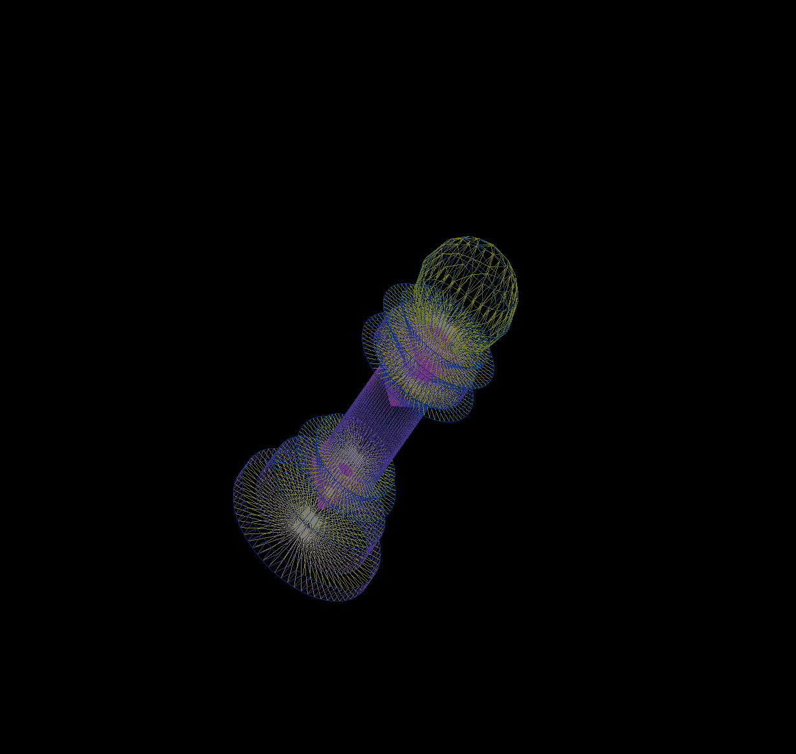
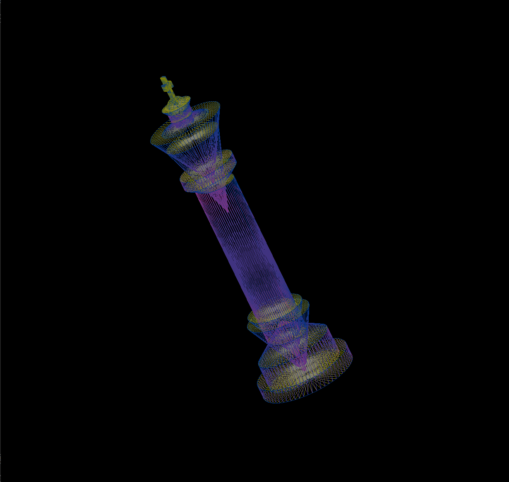

# 3D Modelling/Rendering Interface
Author -  Suhas G (22b1826)

This project demonstrates rendering of basic 3D shapes using the
OpenGL graphics library. The rendered shapes can be
transformed(translated, rotated and scaled). This project
demonstrates how the modern 3D graphics world is made up of
triangular primitives.

## Hierarchy Tree Model
All the shapes added in the application are added as a daughter
of the previous shape. Which makes the previously added shape
the parent of the newly added shape. Any transformation applied
to the parent is also applied to the daughter node.
## How to Run

- Make sure that OpenGL and gcc are installed properly in your pc
- Pull the Tut1 directory from github to your local machine
- Run the make script by typing “make” in your linux(preferably ubuntu terminal)
- Now you should be able to see a “modelling” executable in the directory.
- Run the executable by entering “./modelling” in your terminal
- A new window will appear where all your models go.

## Key Maps

| Key             | Function                                                                |
| ----------------- | ------------------------------------------------------------------ |
| M,I |  Modelling and Inspection mode |
| 1, 2, 3, 4 | remove the last added shape  |
| 5 | Rotation, Translation and Scaling mode applies to the last added shape |
| R, T, G |Rotation, Translation and Scaling mode, applies to the last added shape  |
| X,Y,Z |Axis along which the transformation should be applied  |
| left_arrow,right_arrow| increment and decrement the transformation in the respective direction |
| +, - | increase and decrease the precision of the increment and decrement operation by a factor of 2. |
| S | Save model to a local file. Name to be given in the terminal. |
| L |Load a saved model from the file. Name of the file to be given in the terminal. |
| E |Edit the loaded model after loading it. Initially the rootnode is the current which make the transformations apply to thewhole model. Pressing E allows you to edit the last added shape to the model.  |
| P |toggle projection view  |

## Screenshots

Pawn.mod:

King.mod:

## Acknowledging supporters

 - Rahul Lande(22b1826)
 - Nikil S(22b0963)
 - ​Perplexity (used only for cpp syntax)

## Declaration
I solemnly swear that I am upto no good :) yet I have not copied any
code from other people and have adhered to the course’s policy and
conduct.

-Suhas